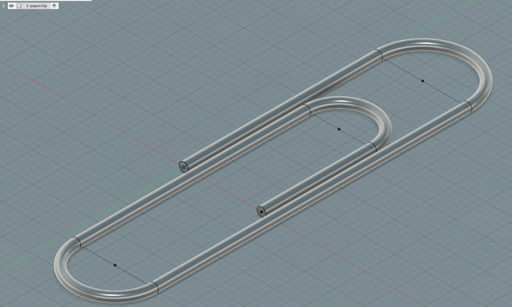
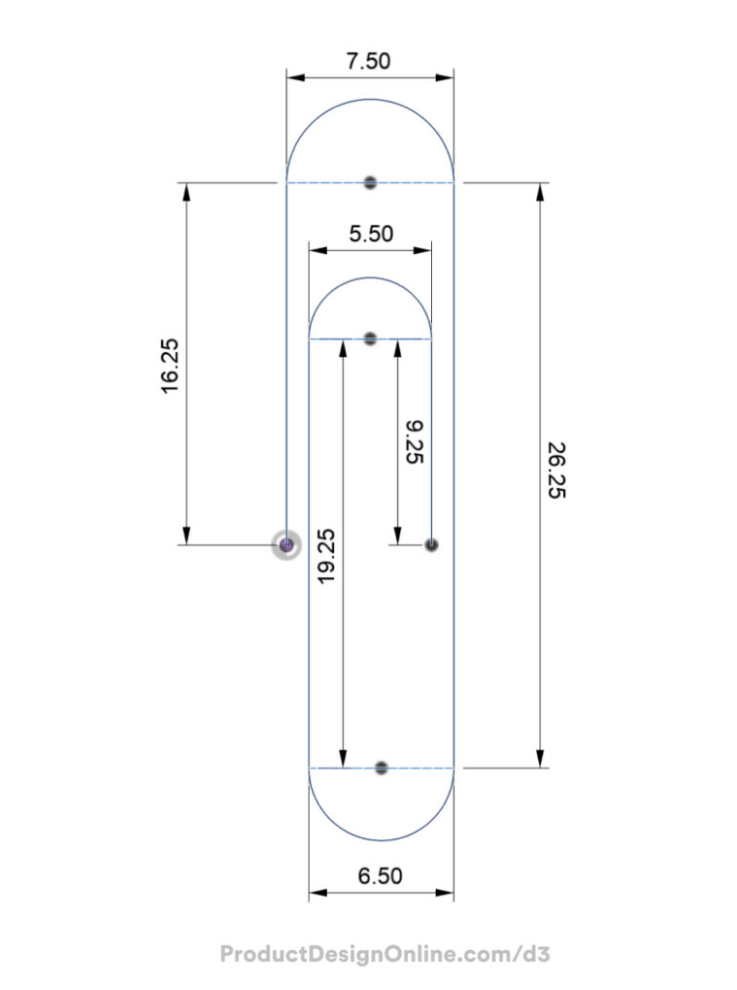

# Fusion 360 Learning: Paperclip Modeling

This project documents the process of learning Fusion 360 by creating a 3D model of a paperclip using dimensions derived from a reference photo.

## Learning Process

The modeling workflow involved several key Fusion 360 techniques:

* **Sketching:** Using the line tool to create sketching paths starting from the origin.
* **Constraints:** Applying geometric constraints to ensure accuracy.
* **Construction Geometry:** Using construction lines to convert geometry into tangent arcs.
* **Sketch Profiles:** Creating a sketch profile on a specific plane.
* **Solid Modeling:** Applying the **Solid Sweep** command to create the 3D geometry.
* **Advanced Sweep Controls:** Understanding **chain selection** and adjusting the **sweep distance** from 0 to 1.

## Reference Images

  
  

## Files in this folder

* [3-paperclip.stl](3-paperclip.stl) import to Software for 3D printing.
* [paperclip-f360.png](paperclip-f360.png) snap of model in F360 software.
* [paperclip-reference-dimensions.png](paperclip-reference-dimensions.png) reference model sheet.
