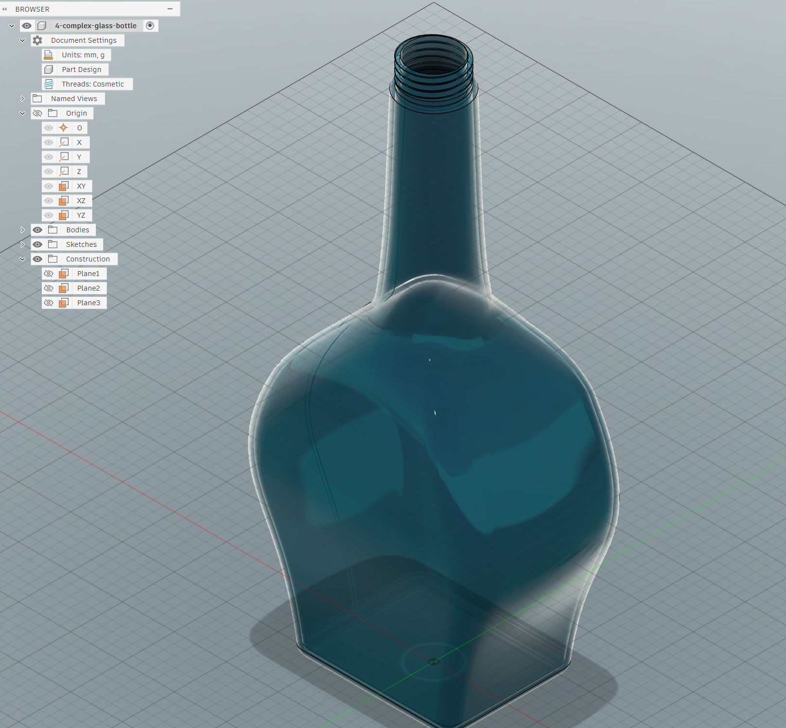

# 4 - Complex Glass Bottle

This folder contains a custom glass bottle model created from scratch in Fusion 360.

## Model Preview

You can preview the 3D model directly from the repository by opening the STL file:

[Open `4-complex-glass-bottle.stl`](./4-complex-glass-bottle.stl)

> If your platform supports GitHub's 3D model preview for STL files, click the link above to view it in the browser.

## Design Overview

The model was built using a multi-sketch loft workflow with careful sketch and construction-plane management.

### Key steps in the workflow

- Start sketches on the XY origin plane at the bottom of the bottle.
- Use `R` to activate rectangle and place a center rectangle around the origin.
- Keep symmetry centered on the X-axis for easier mirroring.
- Apply sketch fillets before creating 3D geometry to round corners in the profile.
- Prefer model fillets over sketch fillets when removing constraints, while still using sketch fillets for lofts and sweeps.
- Finish each sketch so it appears separately in the timeline/history.

### Sketch and construction guidance

- Sketches require a plane, planar face, or construction plane; they cannot float in space.
- Use `Solid > Construction > Offset Plane` when you need a new sketch plane.
- Offset from the origin whenever possible so the plane stays stable as the design changes.
- Hide existing sketches when they obstruct the current active sketch.
- Use the Home view button to verify you are on the correct plane.

### Lofting and guide geometry

- Use lofts for shapes without full symmetry.
- Select each sketch profile in order to create a smooth transition.
- Use guide rails or a centerline to control loft shape.
- Guide rails must touch every loft profile.
- Only one centerline can be used at a time for loft control.
- If loft errors appear, verify that splines and lines connect continuously.

### Rail sketch technique

- Create intersect projections to place points exactly where existing sketches cross the active plane.
- Use coincident constraints to keep guide lines anchored to these intersection points.
- Draw a fitpoint spline or fitpoint sketch to shape one side of the bottle.
- Mirror the completed half sketch across the Z-axis to build the opposite side.

### Final solid modeling steps

- Use `Solid > Fillet` before hollowing the bottle to round edges cleanly.
- Add a top-profile circle and extrude it, joining the body so the shell can work with a single solid body.
- Apply `Solid > Shell` from the top opening with the desired thickness.
- Add a final edge fillet around the bottle lip.
- Use `Solid > Thread` with the modeled option checked so the result is printable, not just cosmetic.

## What I learned

- Sketches must start on a defined plane or construction surface.
- Sketch fillets are great for rounding profiles early, but model fillets are better when you need to remove constraints.
- Loft profiles need ordered, closed sketches and clean transitions.
- Guide rails must touch every loft profile to work correctly.
- Project/include intersections are useful to locate sketch points precisely.
- Coincident constraints keep rail sketches firmly attached to profile geometry.
- Mirroring a completed half can speed up symmetric bottle shapes.
- Shelling works best when the solid body is joined and the top opening is properly defined.
- Modeled threads are required for 3D printing, not just cosmetic thread representations.

## Files

- `4-complex-glass-bottle.stl` — exported STL of the finished bottle model.
